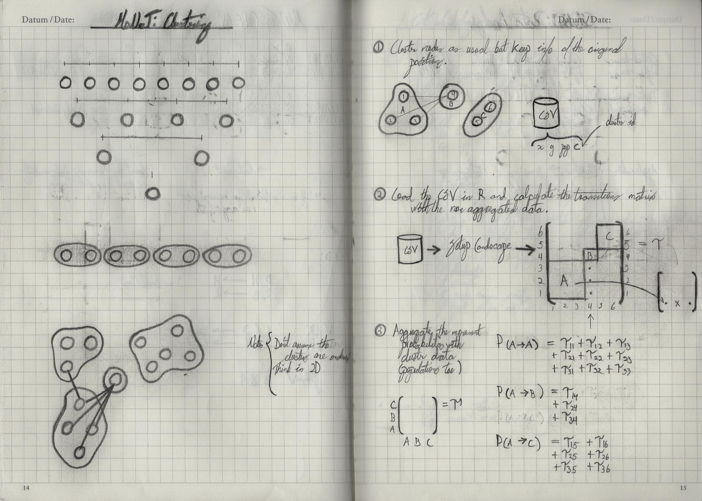

# labNotesEnhancer

Repo created to enhance my scanned labnotes. Takes a scanned notebook, rotates,
and processes images through the pipeline.

```bash
python main.py SUBFOLDER DeleteFiles FilesPattern
```

Example of use:

```bash
python main.py Volume01 OVW Scan
```


Gets transformed into:



# Author

<br>

[Héctor M. Sánchez C.](https://chipdelmal.github.io/blog/)
